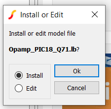

<!-- Please do not change this logo with link -->

# Comparing Simulation to Reality with PIC18F56Q71

This code example contains the code and analog simulation models for the upcoming video "Comparing Simulation to Reality with PIC18F56Q71". This video will compare an analog circuit simulation to the performance of the real, physical device. 

## Related Documentation

- [Maximizing the Signal: How to Use and Understand Embedded Operational Amplifiers (AN3110)](https://www.microchip.com/en-us/application-notes/an3110?utm_source=GitHub&utm_medium=TextLink&utm_campaign=MCU8_MMTCha_pic18q71&utm_content=pic18f56q71-mindi-compare-mplab-mcc)

## Simulation Software

- [MPLAB Mindi&trade; Analog Simulator](https://www.microchip.com/en-us/tools-resources/develop/analog-development-tool-ecosystem/mplab-mindi-analog-simulator?utm_source=GitHub&utm_medium=TextLink&utm_campaign=MCU8_MMTCha_pic18q71&utm_content=pic18f56q71-mindi-compare-mplab-mcc)
- [PIC18F56Q71 Mindi Model](https://www.microchip.com/en-us/software-library/analog-simulation-pic18f56q71?utm_source=GitHub&utm_medium=TextLink&utm_campaign=MCU8_MMTCha_pic18q71&utm_content=pic18f56q71-mindi-compare-mplab-mcc)

See *Mindi Model Installation* for details on installing.

## Development Software

- [MPLAB® X IDE v6.0.5 or newer](https://www.microchip.com/en-us/tools-resources/develop/mplab-x-ide?utm_source=GitHub&utm_medium=TextLink&utm_campaign=MCU8_MMTCha_pic18q71&utm_content=pic18f56q71-mindi-compare-mplab-mcc)
- [MPLAB XC8 v2.40.0 or newer](https://www.microchip.com/en-us/tools-resources/develop/mplab-xc-compilers?utm_source=GitHub&utm_medium=TextLink&utm_campaign=MCU8_MMTCha_pic18q71&utm_content=pic18f56q71-mindi-compare-mplab-mcc)
- [MPLAB Code Configurator](https://www.microchip.com/en-us/tools-resources/configure/mplab-code-configurator?utm_source=GitHub&utm_medium=TextLink&utm_campaign=MCU8_MMTCha_pic18q71&utm_content=pic18f56q71-mindi-compare-mplab-mcc)
- PIC18F-Q_DFP v1.15.360 or newer

## Hardware Used

- PIC18F56Q71 Curiosity Nano
- Oscilloscope
- 10x Oscilloscope Probe (with hook adapter)
- Function Generator
- BNC T-Junction (female to 2x male)
- BNC-BNC Cable (female to female)
- BNC (female) to Mini-Hooks Cable

## Hardware Setup

**Warning: Do not apply voltages outside of the absolute maximum ratings to the I/O of the microcontroller. This may cause permanent damage to the device, the Curiosity Nano, and/or the connected computer!**

### Test Setup

*Note: These instructions assume the nano has been programmed. If it has not, make the sure the nano can be connected to a computer for programming after all cables are attached.*

Setup the function generator waveform output. The configured waveform should always remain within the absolute maximum ratings of the microcontroller. (By default, the Curiosity Nano runs at 3.3V.)

For the video, the following waveform settings were used:

| Setting | Value 
| ------- | ----- 
| Waveform | Sine 
| Frequency | 1 kHz 
| Amplitude | 1 Vpp 
| Offset | 500 mV
| Load | Hi-Z

*With the output OFF*, connect the function generator output to the BNC T-Junction. Then, use a BNC-BNC cable to connect one side of the T-junction to your oscilloscope. **After connecting, make sure this oscilloscope channel is set to 1x mode with 1M&Omega; termination.**

Next, use the BNC to Mini-Hooks cable to connect from the other side of the T-junction to the Curiosity Nano. Connect the ground hook to a GND point or pin, and connect the signal to RB1. Then, connect your 10x oscilloscope probe to RA1 on the nano. (This oscilloscope input should also be set to 1M&Omega; termination.)

For the oscilloscope ground, connect to a ground point or pin on the nano. The gold-plated mounting holes on the USB-side can be used for grounding, but be beware of any electronic components nearby. Alternatively, a female-to-male wire can be used on a ground pin for a suitable connection.

If the nano has been programmed, plug the nano into any USB power supply or port. Then, enable the output of the function generator.

If the nano has NOT been programmed, connect the nano to a computer and perform *Drag-and-Drop programming*, which is described below. (Alternatively, you can compile from source and program in MPLAB X IDE).

### Drag-and-Drop Programming  

1. On the Github page for this example, go to the Releases section on the right-side of the screen.  
  
2. Download and unzip the hex files for the example.
3. Select one of the provided hex files and drag-and-drop the file over the Curiosity Nano icon in the File Explorer. (Both hex files will function identically on the device, the difference is in memory usage.)  

4. If programming is successful, the yellow LED should start blinking.

### Microcontroller I/O Summary

| Pin | Description 
| --- | -----------
| RA1 | OPAMP Output (to oscilloscope)
| RB1 | Analog Input (from function generator)
| RC7 | Blinking LED Indicator

## Mindi Model Installation
1. [Download and install MPLAB Mindi](https://www.microchip.com/en-us/tools-resources/develop/analog-development-tool-ecosystem/mplab-mindi-analog-simulator?utm_source=GitHub&utm_medium=TextLink&utm_campaign=MCU8_MMTCha_pic18q71&utm_content=pic18f56q71-mindi-compare-mplab-mcc)
2. [Download the Mindi model for the PIC18F56Q71 family of microcontrollers](https://www.microchip.com/en-us/software-library/analog-simulation-pic18f56q71?utm_source=GitHub&utm_medium=TextLink&utm_campaign=MCU8_MMTCha_pic18q71&utm_content=pic18f56q71-mindi-compare-mplab-mcc)
3. Drag and drop the model file into the *Command Shell* of Mindi  

4. There will be a prompt to install the model  
  
5. This model can now be found within Mindi

## Operation

This example implements a simple non-inverting operational amplifier with a gain of 2, as shown below. Resistor values are approximate values.

To compare, a Mindi schematic of this same configuration is provided in this repository. 

## Summary
This example provides the source code and documentation for the video.